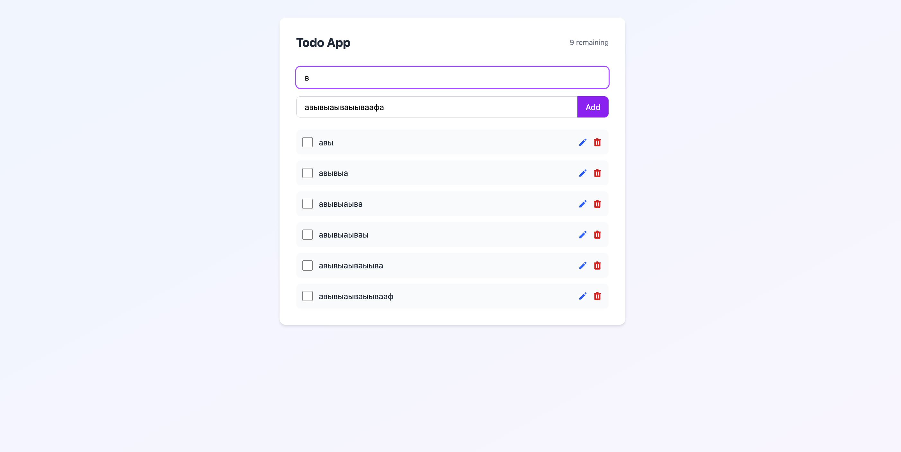

## 📸 Скриншот интерфейса



# sv

Everything you need to build a Svelte project, powered by [`sv`](https://github.com/sveltejs/cli).

## Creating a project

```bash
# create a new project in the current directory
npx sv create

# create a new project in my-app
npx sv create my-app
```

## Developing

Once you've created a project and installed dependencies with `npm install` (or `pnpm install` or `yarn`), start a development server:

```bash
npm run dev

# or start the server and open the app in a new browser tab
npm run dev -- --open
```

## Building

To create a production version of your app:

```bash
npm run build
```

You can preview the production build with `npm run preview`.

> To deploy your app, you may need to install an [adapter](https://svelte.dev/docs/kit/adapters) for your target environment.


## Описание приложения

Это простое приложение для управления задачами (Todo App) на базе Svelte. 

### Основные функции:
- Добавление новых задач
- Просмотр списка задач
- Сохранение данных в IndexDB
- (Бонус) Удаление, редактирование, поиск, сортировка задач, анимации, адаптивность интерфейса

5 ключевых промптов к ИИ

1. "Добавь задачу: Прочитать статью по Svelte"
2. "Покажи все невыполненные задачи"
3. "Найди задачу со словом 'статья'"
4. "Переименуй задачу 'Прочитать статью по Svelte' в 'Прочитать документацию Svelte'"
5. "Отметь задачу 'Прочитать документацию Svelte' как выполненную"


Время на каждый этап:
Задание 1: "Быстрая настройка" (30 мин)
Задание 2: "Основная функциональность" (1 час 30 мин)
Задание 3: "Финальная доработка" (30 час)
Задание 4: "Отладка и тестирование" (15минут)
Задание 5: "Бонусные функции" (20 мин)